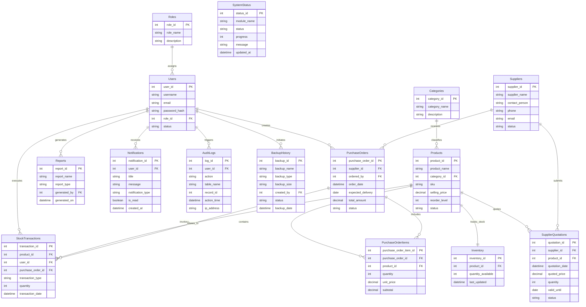
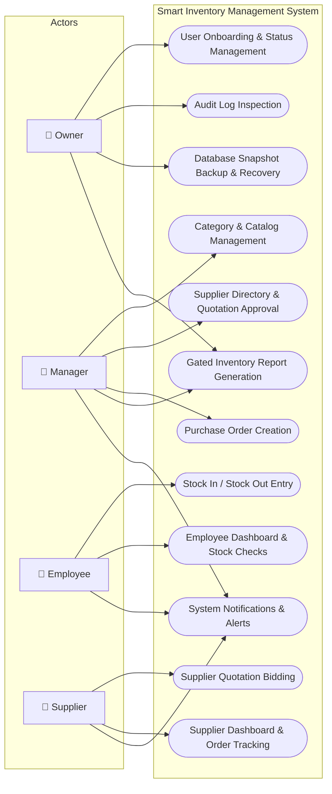
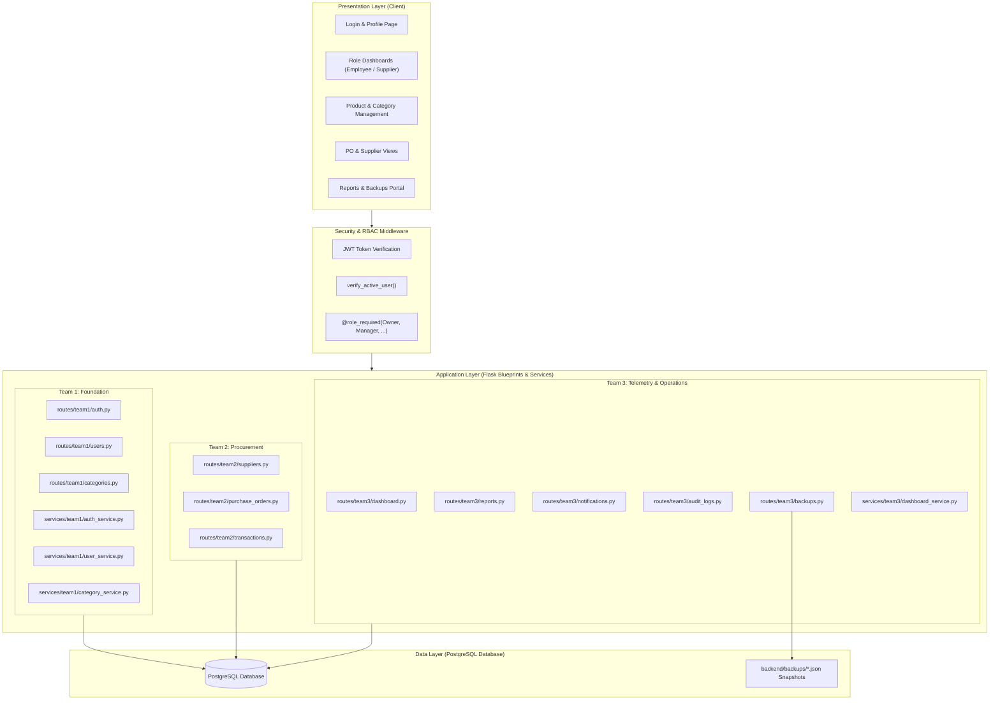
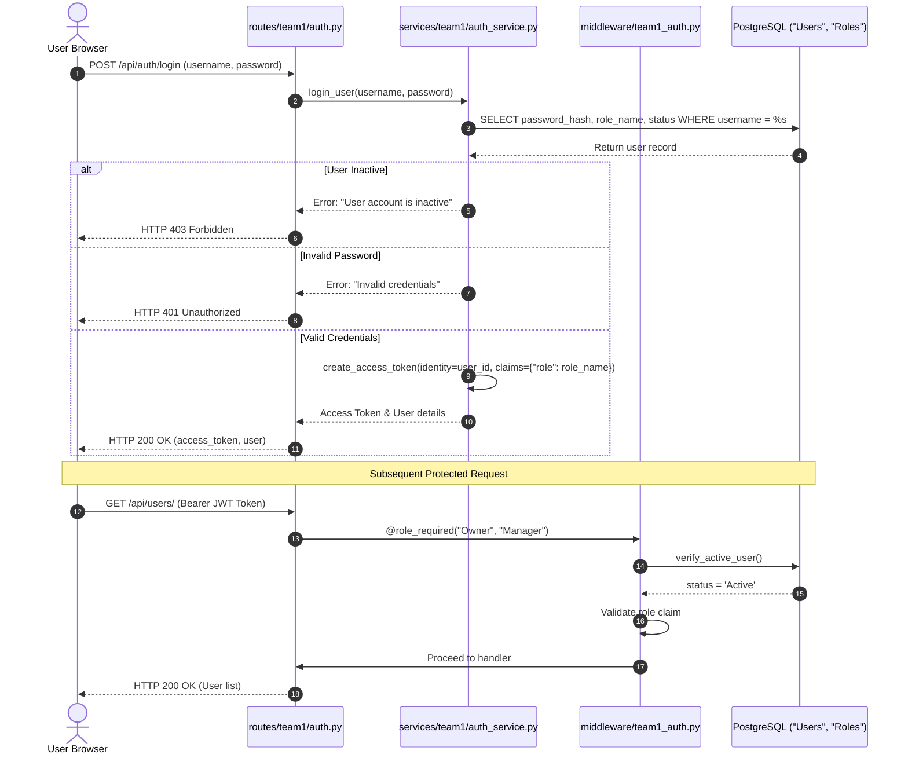
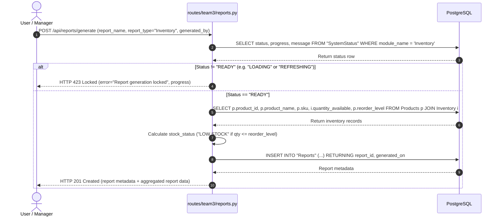
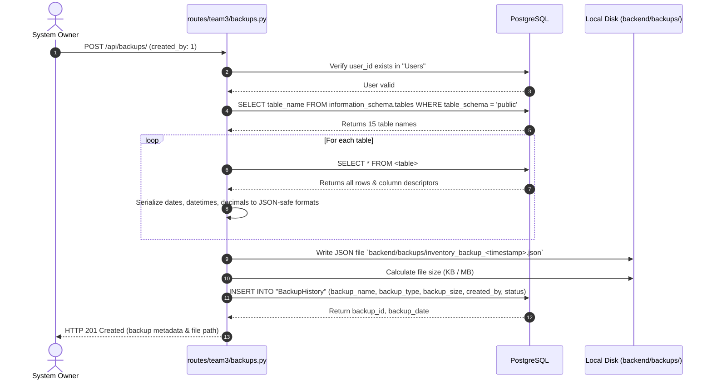

# Smart Inventory Management System (SIMS) - UML & Architectural Diagrams

This document contains visual architectural specifications and models for SIMS using standard **Mermaid** syntax, supported directly in GitHub, Markdown viewers, and documentation tools.

---

## 1. Entity-Relationship Diagram (ERD) - 15 Tables

---

## 2. System Use Case Diagram

---

## 3. High-Level Component & Tier Architecture

---

## 4. Sequence Diagram: Authentication & Role Verification Flow

---

## 5. Sequence Diagram: Gated Inventory Report Generation

---

## 6. Sequence Diagram: Automated Full Database Backup

