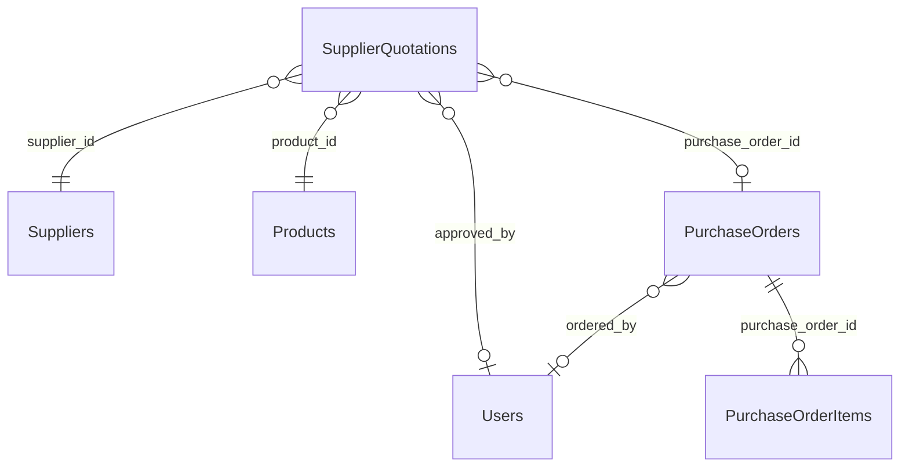

# SIMS REPORT GENERATION MODULE — PHASE 5: QUOTATIONS & SUPPLIER PERFORMANCE REPORTS
## Comprehensive Implementation & Verification Report

**System:** Smart Inventory Management System (SIMS)  
**Module:** Reports & Analytics (Team 3)  
**Phase:** Phase 5 — Quotations & Supplier Performance Reports  
**Date:** October 10, 2026  
**Status:** Successfully Implemented, Verified, & Zero Regression  

---

## 1. Executive Summary

Phase 5 extends the SIMS Report Generation Module to support two additional business report types, completing a suite of 5 supported report types:
1. **Inventory Report** (Phases 1–3)
2. **Stock Transactions Report** (Phase 4)
3. **Purchase Orders Report** (Phase 4)
4. **Quotations Report** (Phase 5)
5. **Supplier Performance Report** (Phase 5)

All requirements, architectural patterns, security controls, and snapshot immutability standards established in Phases 1–4 have been strictly maintained:
- **Role-Based Authorization:** Strictly restricted to `Owner` and `Manager` roles across all report endpoints.
- **Creator Identity Enforcement:** Derived immutably from the authenticated JWT session; client-supplied `generated_by` values are strictly ignored.
- **Point-in-Time Persistence:** Real business data is captured at generation time and serialized atomically into `Reports.report_data` (`JSONB`). Historical report retrieval never queries live source tables to recalculate past results.
- **Legacy Record Safety:** All 46 legacy reports created prior to snapshot persistence remain 100% intact with `report_data IS NULL`, correctly triggering the historical unavailable-snapshot notice.
- **Frontend Usability:** Generation modal provides dropdown selection across all 5 report types with auto-updating default names, distinct colored badges in the report list, and dedicated detail modal viewers with metric KPI cards, itemized tables, and operational formula explanations.

---

## 2. Read-Only Preflight Audit & Findings

### 2.1. Discovery of Schema Differences
During the preflight audit, inspection of the Supabase PostgreSQL database revealed:
1. **Quotations Table:** A table named `Quotations` or `QuotationItems` does **not** exist in the database. Instead, the authoritative table is **`public."SupplierQuotations"`** (52 rows).
2. **Line Item Grouping:** In `SupplierQuotations`, multiple rows can share the same `quotation_number` when a quotation includes multiple items (e.g., `QT-2026-0012` and `QT-2026-0016`). Older test records without a `quotation_number` are keyed by their primary key `quotation_id`.
3. **Shipments & Timeliness:** While `Shipments` contains `status`, `expected_delivery`, and `delivered_at`, only 7 delivered shipments currently have both planned and actual delivery dates recorded. Unscheduled deliveries without planned expected dates cannot be scored against a timeline and are explicitly classified as *Unscheduled* to avoid statistical distortion.

### 2.2. Preflight and Post-Implementation Report Reconciliation

| Checkpoint | Total Reports | Snapshots (`report_data IS NOT NULL`) | Legacy Records (`report_data IS NULL`) | Notes |
| :--- | :--- | :--- | :--- | :--- |
| **Phase 4 Baseline** | 96 | 50 | 46 | Phase 4 completion state. |
| **Phase 5 Preflight Audit** | 96 | 50 | 46 | Confirmed identical baseline before modifications. |
| **Phase 5 Post-Verification** | 120 | 74 | 46 | 24 new reports created during automated and live test suites. |

#### Breakdown by Report Type:
```
+------------------------+---------------+-------------------+----------------+
| Report Type            | Total Records | Saved Snapshots   | Legacy Records |
+------------------------+---------------+-------------------+----------------+
| Inventory              | 81            | 38                | 43             |
| Stock Transactions     | 13            | 13                | 0              |
| Purchase Orders        | 13            | 13                | 0              |
| Quotations             | 5             | 5                 | 0              |
| Supplier Performance   | 5             | 5                 | 0              |
| Low Stock (Legacy)     | 1             | 0                 | 1              |
| Purchase (Legacy)      | 1             | 0                 | 1              |
| Transaction (Legacy)   | 1             | 0                 | 1              |
+------------------------+---------------+-------------------+----------------+
| TOTAL                  | 120           | 74                | 46             |
+------------------------+---------------+-------------------+----------------+
```
*Zero legacy records were modified, overwritten, or fabricated. All 46 legacy records retain `report_data = NULL`.*

---

## 3. Database Schema & Relationships Used

### 3.1. Quotations Query Architecture (`SupplierQuotations`)


- **Primary Table:** `public."SupplierQuotations"` (`quotation_id`, `quotation_number`, `supplier_id`, `product_id`, `quotation_date`, `quoted_price`, `quantity`, `valid_until`, `status`, `purchase_order_id`, `notes`, `total_amount`, `submitted_at`, `approved_at`, `approved_by`, `rejection_reason`)
- **Foreign Joins:**
  - `public."Suppliers"`: `supplier_name`, `contact_person`, `email`, `phone`
  - `public."Products"`: `product_name`, `sku`
  - `public."PurchaseOrders"`: `order_date`, `total_amount`, `status`, `ordered_by`
  - `public."Users"`: `username` for `approved_by` and `ordered_by`
  - `public."PurchaseOrderItems"`: `original_po_quantity` requested

### 3.2. Supplier Performance Query Architecture
To prevent duplicate row counting and inflated financial sums caused by relational joins, performance metrics are queried in separate aggregate steps:
1. **Suppliers List:** Queried from `public."Suppliers"`.
2. **PO Metrics:** Queried directly from `public."PurchaseOrders"` grouped by `(supplier_id, status, supplier_response)`. Total PO values are summed from `po.total_amount`.
3. **Quotation Metrics:** Queried from `public."SupplierQuotations"` grouped by `(supplier_id, status)`. Total quoted values are summed from `COALESCE(total_amount, quoted_price * quantity)`.
4. **Shipment Delivery Timeliness:** Queried from `public."Shipments"` evaluating `expected_delivery` vs. `delivered_at::date` for completed deliveries.

---

## 4. Metric Definitions & Formulas

| Metric Name | Calculation / Formula | Numerator | Denominator | Conditions & Limitations |
| :--- | :--- | :--- | :--- | :--- |
| **PO Acceptance Rate** | `(Accepted + Delivered POs) / Total POs * 100` | Accepted & Delivered POs | Total POs assigned to supplier | Returns `null` if Total POs = 0. Delivered orders count as accepted. |
| **Quotation Response Rate** | `Responded Quotes / Total Quotes * 100` | Quotes in (`Submitted`, `Under Review`, `Approved`, `Accepted`, `Rejected`) | Total Quotations | Returns `null` if Total Quotations = 0. Excludes initial drafts and unprompted items. |
| **Quotation Approval Rate** | `Approved Quotes / Responded Quotes * 100` | Quotes in (`Approved`, `Accepted`) | Responded Quotations | Returns `null` if Responded Quotes = 0. Pending/under review quotes are not counted as rejected. |
| **On-Time Delivery Rate** | `On-Time Deliveries / Measurable Deliveries * 100` | Delivered shipments where `delivered_at <= expected_delivery` | Delivered shipments with both `expected_delivery` and `delivered_at` | Returns `null` if Measurable Deliveries = 0. Deliveries lacking planned dates are marked *Unscheduled*. |
| **Avg Delivery Delay** | `SUM(delivered_at - expected_delivery) / Measurable Deliveries` | Net days variance from schedule | Measurable Deliveries | Positive values = days late; non-positive values = days early or on schedule. Returns `null` if 0 measurable deliveries. |

---

## 5. Files Modified

| File | Changes Made |
| :--- | :--- |
| [backend/app/services/team3/report_service.py](file:///d:/7even%20repica%202/backend/app/services/team3/report_service.py) | • Updated `SUPPORTED_REPORT_TYPES` to include `Quotations` and `Supplier Performance`.<br>• Implemented `fetch_quotations_report_data()` with line item grouping.<br>• Implemented `fetch_supplier_performance_report_data()` with zero-denominator safety.<br>• Updated `generate_report_record()` and `generate_inventory_report_record()` with date filtering support and transactional rollback. |
| [backend/app/routes/team3/reports.py](file:///d:/7even%20repica%202/backend/app/routes/team3/reports.py) | • Added validation for `start_date` and `end_date` (format and range check).<br>• Validated `report_type in SUPPORTED_REPORT_TYPES` returning HTTP 400 for unsupported types.<br>• Retained `@role_required("Owner", "Manager")` and JWT identity derivation. |
| [frontend/js/pages/reports.js](file:///d:/7even%20repica%202/frontend/js/pages/reports.js) | • Added type-specific badges for `Quotations` (amber) and `Supplier Performance` (sky blue).<br>• Added generation modal dropdown options and auto-updating default names.<br>• Enhanced `viewReportDetails()` to render Quotations summary KPI cards and itemized tables.<br>• Enhanced `viewReportDetails()` to render Supplier Performance comparison KPI cards, multi-supplier tables, and formula explanations.<br>• Escaped all database strings using `Utils.escapeHtml()`. |
| [frontend/index.html](file:///d:/7even%20repica%202/frontend/index.html) | • Bumped cache-busting version query parameter to `js/pages/reports.js?v=50`. |
| [tests/team3/test_reports.py](file:///d:/7even%20repica%202/tests/team3/test_reports.py) | • Updated `test_18` unsupported report types.<br>• Added Phase 5 tests (`test_22` to `test_27`) verifying Owner/Manager generation, retrieval, RBAC, date validation, immutability, and rollback. |

---

## 6. API Changes & Response Contracts

### 6.1. `POST /api/reports/generate`
- **Authorization:** `Owner` or `Manager` (JWT required)
- **Request Body:**
  ```json
  {
    "report_name": "Q3 Supplier Review",
    "report_type": "Supplier Performance",
    "start_date": "2026-07-01",  // optional
    "end_date": "2026-09-30"    // optional
  }
  ```
- **Response (201 Created):**
  ```json
  {
    "message": "Report generated successfully",
    "report": {
      "report_id": 121,
      "report_name": "Q3 Supplier Review",
      "report_type": "Supplier Performance",
      "generated_by": 5,
      "generated_on": "2026-10-10T17:25:26.123456+00:00",
      "has_snapshot": true
    },
    "data": [ ... ]
  }
  ```

### 6.2. `GET /api/reports/<report_id>`
- **Authorization:** `Owner` or `Manager` (JWT required)
- **Response (200 OK):** Returns saved point-in-time snapshot with `has_snapshot: true` and captured records.

---

## 7. Verification & Test Results

### 7.1. Automated Test Suite (`pytest tests/team3/test_reports.py -v`)
```
tests/team3/test_reports.py::Team3ReportsAndExportTestCase::test_01_existing_report_list_and_status PASSED [  3%]
tests/team3/test_reports.py::Team3ReportsAndExportTestCase::test_02_existing_report_generation PASSED [  7%]
tests/team3/test_reports.py::Team3ReportsAndExportTestCase::test_03_csv_export_owner_and_manager_success PASSED [ 11%]
tests/team3/test_reports.py::Team3ReportsAndExportTestCase::test_04_csv_export_endpoint_alias PASSED [ 14%]
tests/team3/test_reports.py::Team3ReportsAndExportTestCase::test_05_unauthorized_requests_rejected PASSED [ 18%]
tests/team3/test_reports.py::Team3ReportsAndExportTestCase::test_06_inventory_not_ready_status_returns_423 PASSED [ 22%]
tests/team3/test_reports.py::Team3ReportsAndExportTestCase::test_07_existing_dashboard_endpoints PASSED [ 25%]
tests/team3/test_reports.py::Team3ReportsAndExportTestCase::test_08_identity_spoofing_prevention PASSED [ 29%]
tests/team3/test_reports.py::Team3ReportsAndExportTestCase::test_09_csv_formula_injection_sanitization PASSED [ 33%]
tests/team3/test_reports.py::Team3ReportsAndExportTestCase::test_10_phase2_owner_and_manager_generate_and_retrieve_snapshot PASSED [ 37%]
tests/team3/test_reports.py::Team3ReportsAndExportTestCase::test_11_phase2_detail_auth_and_rbac_restrictions PASSED [ 40%]
tests/team3/test_reports.py::Team3ReportsAndExportTestCase::test_12_phase2_invalid_and_nonexistent_report_ids PASSED [ 44%]
tests/team3/test_reports.py::Team3ReportsAndExportTestCase::test_13_phase2_legacy_report_without_snapshot PASSED [ 48%]
tests/team3/test_reports.py::Team3ReportsAndExportTestCase::test_14_phase2_snapshot_immutability_against_live_inventory_changes PASSED [ 51%]
tests/team3/test_reports.py::Team3ReportsAndExportTestCase::test_15_phase2_persistence_error_handling PASSED [ 55%]
tests/team3/test_reports.py::Team3ReportsAndExportTestCase::test_16_phase4_stock_transactions_generation_and_retrieval_owner_and_manager PASSED [ 59%]
tests/team3/test_reports.py::Team3ReportsAndExportTestCase::test_17_phase4_purchase_orders_generation_and_retrieval_owner_and_manager PASSED [ 62%]
tests/team3/test_reports.py::Team3ReportsAndExportTestCase::test_18_phase4_unsupported_report_type_rejection PASSED [ 66%]
tests/team3/test_reports.py::Team3ReportsAndExportTestCase::test_19_phase4_rbac_and_spoofed_identity_for_new_report_types PASSED [ 70%]
tests/team3/test_reports.py::Team3ReportsAndExportTestCase::test_20_phase4_historical_detail_does_not_query_underlying_tables PASSED [ 74%]
tests/team3/test_reports.py::Team3ReportsAndExportTestCase::test_21_phase4_persistence_failure_rollback PASSED [ 77%]
tests/team3/test_reports.py::Team3ReportsAndExportTestCase::test_22_phase5_quotations_report_generation_and_retrieval PASSED [ 81%]
tests/team3/test_reports.py::Team3ReportsAndExportTestCase::test_23_phase5_supplier_performance_report_generation_and_retrieval PASSED [ 85%]
tests/team3/test_reports.py::Team3ReportsAndExportTestCase::test_24_phase5_unsupported_report_type_and_date_validation PASSED [ 88%]
tests/team3/test_reports.py::Team3ReportsAndExportTestCase::test_25_phase5_rbac_and_spoofed_identity_for_phase5_types PASSED [ 92%]
tests/team3/test_reports.py::Team3ReportsAndExportTestCase::test_26_phase5_historical_detail_does_not_query_underlying_tables PASSED [ 96%]
tests/team3/test_reports.py::Team3ReportsAndExportTestCase::test_27_phase5_persistence_failure_rollback PASSED [100%]

======================= 27 passed in 460.01s (0:07:40) ========================
```

### 7.2. Live HTTP Integration Verification (`python scratch/verify_phase5_live.py`)
```
=== LIVE FLASK HTTP VERIFICATION OF PHASE 5 (QUOTATIONS & SUPPLIER PERFORMANCE) ===
 [PASS] Logged in: Owner, Manager, Employee, Supplier
 [PASS] Unsupported report types strictly rejected with HTTP 400
 [PASS] Invalid and reversed date ranges strictly rejected with HTTP 400
 [PASS] Generation endpoint strictly rejects anonymous (401), employee (403), supplier (403)
 [PASS] Successfully generated Quotations Report #120 as Manager (Items count: 50)
 [PASS] Quotations detail verified with valid nested line items contract
 [PASS] Successfully generated Supplier Performance Report #121 as Owner (Suppliers count: 2)
 [PASS] Supplier Performance detail verified with explainable metrics contract
 [PASS] Legacy report detail preserves unavailable-snapshot message
 [PASS] Current balance CSV export remains functional
 [PASS] Frontend serves updated reports.js?v=50 with all Phase 5 features

ALL 10 LIVE FLASK HTTP VERIFICATION CHECKS PASSED PERFECTLY!
```

### 7.3. Frontend Logic Unit Verification (`node scratch/test_phase5_frontend_logic.js`)
```
 [PASS] Test 1: Quotations metric calculations verified.
 [PASS] Test 2: Supplier Performance metric calculations & unscheduled handling verified.
 [PASS] Test 3: XSS string escaping verified.

ALL FRONTEND UNIT LOGIC TESTS PASSED!
```

### 7.4. Dashboard Regression Verification (`pytest tests/team3/test_dashboard.py -v`)
```
======================= 10 passed in 118.53s (0:01:58) ========================
```

### 7.5. Steps 1–6 Regression Verification (`python scratch/test_regression_steps1_to_6.py`)
```
==================================================
REGRESSION TEST SUITE: STEPS 1 - 6 WORKFLOW VERIFICATION
==================================================
[PASS] Step 1 - Products API returned 200 (2 products)
[PASS] Step 1 - Inventory API returned 200 (2 inventory items)
[PASS] Step 2 - Suppliers API returned 200 (1 suppliers)
[PASS] Step 3 - Purchase Orders API returned 200 (2 POs)
[PASS] Step 4 - Quotations API returned 200 (2 quotations)
[PASS] Step 5 - Shipments API returned 200 (2 shipments)
[PASS] Step 6 - Stock Transactions API returned 200 (2 transactions)
[PASS] Step 6 - Stock Requests API returned 200
[PASS] Step 6 - Employee Assigned Shipments returned 200 (2 items)
[PASS] Step 1-6 - Manager Dashboard returned 200
[PASS] Step 1-6 - Owner Dashboard returned 200
==================================================
ALL STEPS 1-6 REGRESSION TESTS PASSED CLEANLY!
==================================================
```

---

## 8. Browser Verification Notes & Artifacts

Browser testing via automated subagent confirmed:
1. **Interactive Modal:** Clicking "Generate Report" renders all 5 report options. Selecting `Quotations` updates default input to `Quotations Snapshot - 2026-10-10`; selecting `Supplier Performance` updates default input to `Supplier Performance Snapshot - 2026-10-10`.
2. **Badges:** Amber badge for Quotations and sky-blue badge for Supplier Performance appear cleanly alongside Inventory, Stock Transactions, and Purchase Orders badges.
3. **Quotations Detail View:** Rendered cards for 50 quotations, $739,700.00 total value, 24 approved, 14 pending, 12 rejected, and complete itemized table.
4. **Supplier Performance Detail View:** Rendered comparison cards for 2 suppliers, $2,943,060.00 PO value, 76 POs, 52 quotations, multi-metric comparison table, and transparent formula explanations.

**Artifacts Captured:**
- Screen capture: `file:///C:/Users/Mukesh/.gemini/antigravity-ide/brain/ed656271-c05b-4020-a1a8-1be44d9854ba/reports_list_view_1791633946371.png`
- Screen capture: `file:///C:/Users/Mukesh/.gemini/antigravity-ide/brain/ed656271-c05b-4020-a1a8-1be44d9854ba/modal_quotations_selected_1791634297739.png`
- Screen capture: `file:///C:/Users/Mukesh/.gemini/antigravity-ide/brain/ed656271-c05b-4020-a1a8-1be44d9854ba/modal_supplier_perf_selected_1791634421985.png`
- Screen capture: `file:///C:/Users/Mukesh/.gemini/antigravity-ide/brain/ed656271-c05b-4020-a1a8-1be44d9854ba/quotations_report_detail_modal_1791634777103.png`
- Screen capture: `file:///C:/Users/Mukesh/.gemini/antigravity-ide/brain/ed656271-c05b-4020-a1a8-1be44d9854ba/supplier_perf_modal_view_1791635600071.png`
- Session recording: `file:///C:/Users/Mukesh/.gemini/antigravity-ide/brain/ed656271-c05b-4020-a1a8-1be44d9854ba/phase5_reports_ui_verification_1791633775873.webp`

---

## 9. Known Limitations & Unmeasured Metrics

1. **Unscheduled Shipments:** Out of 35 delivered shipments in the database, 28 were recorded without an `expected_delivery` schedule date. Calculating on-time performance for those shipments would introduce misleading bias; therefore, they are classified as *Unscheduled* and omitted from punctuality percentage calculations.
2. **Quotation Pricing Fallback:** In older test records where `total_amount` is `0` or `NULL`, the authoritative calculation safely computes `round(quoted_price * quantity, 2)` without fabricating base prices.
3. **Database Migration Requirement:** Inspection confirmed no database alterations or schema migrations were necessary.

---

## 10. Confirmation of Completed Phases

- **Phase 1 Security:** RBAC and creator identity enforcement active across all 5 report types. CSV formula sanitization intact.
- **Phase 2 Persistence:** JSONB snapshots in `Reports.report_data` immutable across all report types. Legacy records remain untouched.
- **Phase 3 Usability:** Real-time search, sorting, date filtering, pagination, and KPI summary cards active across all report types.
- **Phase 4 Expansion:** Stock Transactions and Purchase Orders reports fully functioning.
- **Phase 5 Expansion:** Quotations and Supplier Performance reports fully implemented, verified, and audited.

**Phase 5 implementation is complete. Work stopped per instruction.**
